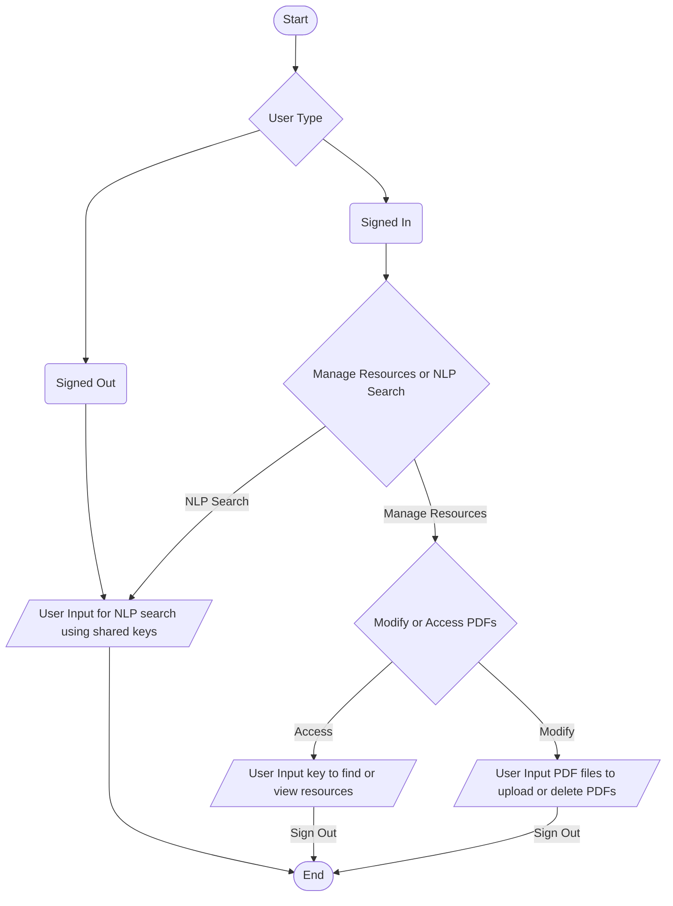

# Past Pilot
An Ed-tech platform for managing academic resources like past papers, with private key-based storage and NLP integration for easy search for similar or specific questions.  

## Funcionality
- Past Pilot is a web app that allows users to upload, download, and share academic resources, such as past papers.
- It uses private key-based storage and integrates NLP to help users find relevant information from their resources.
- It enables users to find similar type of questions and scan through their friends resources. 
- We used [sentence-transformers](https://www.sbert.net/) to calculate text similarity between the user inputs and resources.

## End-User Flow Chart

Video Demonstration: https://youtu.be/FDsQhK5odS0
